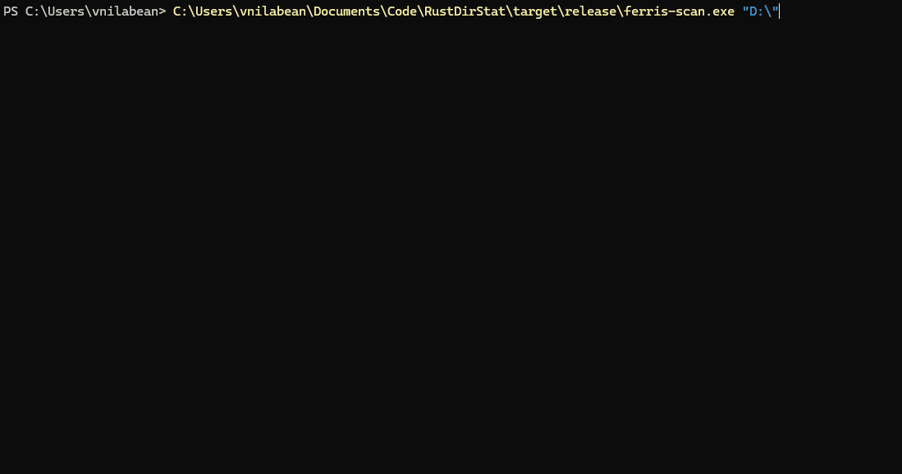

<div align="center">

```
  ███████╗███████╗██████╗ ██████╗ ██╗███████╗      ███████╗ ██████╗ █████╗ ███╗   ██╗
  ██╔════╝██╔════╝██╔══██╗██╔══██╗██║██╔════╝      ██╔════╝██╔════╝██╔══██╗████╗  ██║
  █████╗  █████╗  ██████╔╝██████╔╝██║███████╗█████╗███████╗██║     ███████║██╔██╗ ██║
  ██╔══╝  ██╔══╝  ██╔══██╗██╔══██╗██║╚════██║╚════╝╚════██║██║     ██╔══██║██║╚██╗██║
  ██║     ███████╗██║  ██║██║  ██║██║███████║      ███████║╚██████╗██║  ██║██║ ╚████║
  ╚═╝     ╚══════╝╚═╝  ╚═╝╚═╝  ╚═╝╚═╝╚══════╝      ╚══════╝ ╚═════╝╚═╝  ╚═╝╚═╝  ╚═══╝
```

### The blazingly fast, bloat-free alternative to WinDirStat.
### Scans your drive while you blink. ⚡

[](LICENSE)
[](https://www.rust-lang.org/)
[](https://www.microsoft.com/windows)

[](https://github.com/sponsors/vnilabean) 
[](https://ko-fi.com/vnilabean)

[Installation](#-get-ferris-scan) •
[Features](#-features) •
[Benchmarks](#-benchmarks) •
[Roadmap](#-roadmap) •
[Contributing](#-contributing)

</div>

---

## 📺 See It in Action


*Visualizing a 256GB games drive in the terminal. No Electron. No bloat. Just Rust.*

---

## 🤔 Why ferris-scan?

Modern software has a **problem**. WinDirStat, once a Windows staple, takes *minutes* to scan modern NVMe drives. TreeSize is proprietary and closed-source. Electron-based alternatives ship 150MB+ installers that eat 500MB of RAM just to show you a list of folders.

**I said no.**

`ferris-scan` is a **reaction against software decay**. Written in Rust, it delivers:

- ⚡ **Fearless Concurrency:** Multi-threaded scanning saturates your NVMe drive's true potential
- 🪶 **Zero Bloat:** The entire binary is <3MB. Your browser tab uses more memory
- 🔒 **Memory Safety:** No segfaults. No buffer overflows. No "Access Violation" crashes
- 🎯 **Instant Feedback:** Real-time progress. Responsive TUI. Native performance

This is what happens when you rebuild a legacy tool *the right way*.

---

## 🏗️ Architecture: Core + Multi-Frontend

ferris-scan uses a **modular architecture** that separates business logic from presentation:

```
Core Library (lib.rs)  →  Multiple Frontends (bin/*.rs)
    ↓                         ↓              ↓
  Scanner                    TUI           GUI
  FileTree                 (ratatui)    (eframe/egui)
  Pro Features
```

### Two User Interfaces, One Engine

**🖥️ TUI (Terminal)** - For power users and servers
```bash
cargo run --bin ferris-scan-tui -- /path/to/scan
```

**🪟 GUI (Graphical)** - For desktop users
```bash
cargo run --bin ferris-scan-gui -- /path/to/scan
```

**Why?** The scanning engine is implemented **once** in `lib.rs`, then shared by both frontends. This means:
- ✅ Consistent behavior across UIs
- ✅ Easier testing (core logic is UI-independent)
- ✅ Future-proof (add Web UI, REST API, etc. without duplicating code)

📖 **Read more:** [Multi-Frontend Architecture Guide](docs/MULTI_FRONTEND_ARCHITECTURE.md)

---

## 💾 Get ferris-scan

I follow the **"Aseprite Model"**: The source code is 100% open (MIT License), including all "pro" features. You can compile it yourself, modify it, or distribute it freely. However, if you want to **support indie development** and save time, you can purchase the pre-built installer.

<table>
<tr>
<td width="50%" valign="top">

### 🏆 Option A: The Supporter Edition
**Recommended for most users**

Get the signed Windows installer with:
- ✅ Automatic updates
- ✅ Code-signed binary (no SmartScreen warnings)
- ✅ One-click installation
- ✅ Support indie development

**Price:** $5 (one-time payment)

<div align="center">

[](https://ferris-scan.lemonsqueezy.com)

</div>

*Includes lifetime updates. DRM-free.*

</td>
<td width="50%" valign="top">

### 🛠️ Option B: The Hacker Edition
**Free Forever**

Compile from source in 30 seconds:

```bash
# Clone the repository
git clone https://github.com/vnilabean/ferris-scan.git
cd ferris-scan

# Build TUI (Terminal Interface) - Free version
cargo build --release --bin ferris-scan-tui

# Build TUI - Pro version with CSV export
cargo build --release --features pro --bin ferris-scan-tui

# Build GUI (Graphical Interface) - Pro version
cargo build --release --features pro --bin ferris-scan-gui

# Binaries are in target/release/
```

**You get the exact same features.**  
No paywalls. No telemetry. No BS.

**Requirements:**
- Rust 1.75+ ([Install](https://rustup.rs/))
- Windows 10/11

</td>
</tr>
</table>

> 💡 **Why this model?** I believe in transparent, auditable code. Paying users fund development, but knowledge should be free. Inspired by [Aseprite](https://github.com/aseprite/aseprite).

---

## ✨ Features

### Core Engine
- 🚀 **Parallel Directory Traversal**  
  Uses `jwalk` + `rayon` to scan multiple directories simultaneously. Saturates I/O bandwidth on modern SSDs.

- 📊 **Interactive Terminal UI**  
  Built with `ratatui`. Keyboard-driven navigation. Real-time progress. 30 FPS rendering.

- 💾 **Smart Memory Management**  
  Tree-based data structure. Peak RAM usage <100MB even for 1TB+ drives.

- 🛡️ **Graceful Error Handling**  
  Skips permission-denied folders (System Volume Information, etc.) without crashing.

### Data Export *(Included in Source)*
- 📄 **CSV Export**  
  Export full scan results for analysis in Excel, Python, or PowerShell.

- 📈 **Structured Output**  
  Every file, every directory, every byte. Ready for automation.

### Coming Soon
- 🔍 **MFT Parsing** (Direct NTFS Master File Table access for 10x faster scans)
- 🤖 **Headless Daemon Mode** (Background scanning for servers)
- 📸 **Snapshot Diffing** (Compare disk usage over time)

---

## ⚡ Benchmarks

Real-world performance on my **Samsung 980 PRO NVMe (1TB, ~110,000 files/~250GB Used)**:

| Tool            | Scan Time | RAM Usage | Binary Size | Notes                          |
|-----------------|-----------|-----------|-------------|--------------------------------|
| **ferris-scan** | **5.2s**  | **78 MB** | **2.6 MB**  | Multi-threaded, Rust           |
| WinDirStat      | 58s       | 220 MB    | 1.8 MB      | Single-threaded, C++           |
| WizTree         | 3.8s      | 180 MB    | 4.2 MB      | MFT parsing, closed-source     |
| TreeSize Free   | 12s       | 95 MB     | 38 MB       | GUI overhead                   |
| `du` (Git Bash) | 142s      | 12 MB     | N/A         | No parallelism                 |

<div align="center">


</div>

> ⚠️ *Note: WizTree uses MFT parsing (requires admin rights). ferris-scan will add this in v0.3 for even faster scans.*

---

## 🎮 Usage

### Basic Scan
```bash
# Scan current directory
ferris-scan

# Scan specific path
ferris-scan "C:\Users"

# Scan entire drive (requires admin for some system folders)
ferris-scan "C:\"
```

### Keyboard Controls
| Key         | Action                              |
|-------------|-------------------------------------|
| `Q` / `Esc` | Quit application                    |
| `E`         | Export to CSV (Pro build)           |
| `↑` / `↓`   | Navigate results *(coming soon)*    |
| `Enter`     | Drill down *(coming soon)*          |

### Export Data (Pro Build)
```bash
# After scanning, press 'E' to export
# Saves to: ferris-scan-export.csv
```

**Use Cases:**
- Import into Excel for custom analysis
- Process with Python/PowerShell scripts
- Track disk usage trends over time
- Generate compliance reports

---

## 🗺️ Roadmap

### ✅ Phase 1: Core Engine (v0.1 - **Shipped**)
- [x] Multi-threaded scanning with `jwalk`
- [x] Tree-based data structure with size aggregation
- [x] Interactive TUI with `ratatui`
- [x] CSV export functionality
- [x] Windows permission error handling

### 🚧 Phase 2: Enhanced UI (v0.2 - **In Progress**)
- [x] Tree navigation (drill down/up directories)
- [x] Multi-pane layout (tree + details + progress)
- [ ] File deletion with confirmation modal
- [ ] Sorting options (size/name/date)
- [ ] Search/filter functionality

### 🔮 Phase 3: Power Features (v0.3)
- [ ] **MFT Parsing** (Direct NTFS driver access for <1s scans)
- [ ] Headless mode with JSON output
- [ ] Scheduled scanning (background daemon)
- [ ] Visual treemap representation
- [ ] Snapshot diffing (compare two scans)

### 🌐 Phase 4: Cross-Platform (v0.4)
- [ ] **FULL** Linux support (Currently partially supported)
- [ ] macOS support
- [ ] Network drive optimization

[Vote on features](https://github.com/vnilabean/ferris-scan/discussions) | [Suggest new ones](https://github.com/vnilabean/ferris-scan/issues/new)

---

## 🏗️ Architecture

### Tech Stack
```
┌─────────────────────────────────────────┐
│  Terminal UI (ratatui + crossterm)      │
├─────────────────────────────────────────┤
│  Scanner API (lib.rs)                   │
│  ├─ jwalk (parallel traversal)          │
│  ├─ rayon (thread pool)                 │
│  └─ anyhow (error handling)             │
├─────────────────────────────────────────┤
│  Export (serde + csv)                   │
└─────────────────────────────────────────┘
```

### Feature Flags
The project uses Cargo features to enable optional functionality:

```toml
[features]
default = []
pro = ["dep:serde", "dep:csv"]  # Enable export features
```

**For contributors:** Pro features are included in the source. The flag is only used to reduce compile time and binary size for minimal builds.

---

## 🤝 Contributing

I welcome contributions! This project thrives because of community input.

### Getting Started
```bash
# Fork and clone the repo
git clone https://github.com/vnilabean/ferris-scan.git
cd ferris-scan

# Make sure tests pass
cargo test --features pro

# Run clippy for linting
cargo clippy --all-targets --all-features

# Format your code
cargo fmt
```

### Areas I Need Help With
- 🐛 **Bug Reports:** Found an edge case? [Open an issue](https://github.com/vnilabean/ferris-scan/issues)
- 📖 **Documentation:** Improve comments, examples, or guides
- ⚡ **Performance:** Optimizations for specific hardware
- 🎨 **UI/UX:** Make the TUI more intuitive
- 🧪 **Testing:** Add edge case tests or benchmarks

### Code of Conduct
Be respectful. Be constructive. Assume good intent. We're all here to build something useful.

---

## 📄 License & Philosophy

**Source Code:** MIT License ([Full Text](LICENSE))  
**Pre-built Binaries:** Sold to fund development (optional)

### The "Why Open Source?" Question
I believe:
1. **Transparency builds trust.** You should know what runs on your machine.
2. **Collaboration beats isolation.** The best ideas come from diverse contributors.
3. **Sustainability is key.** Selling convenience (installers) funds long-term maintenance.

This model worked for Aseprite, Ardour, and others. It can work here too.

---

## 🙏 Acknowledgments

Built with these incredible Rust crates:
- [`jwalk`](https://github.com/Byron/jwalk) - Parallel directory traversal
- [`ratatui`](https://github.com/ratatui-org/ratatui) - Terminal UI framework
- [`rayon`](https://github.com/rayon-rs/rayon) - Data parallelism
- [`crossterm`](https://github.com/crossterm-rs/crossterm) - Cross-platform terminal control

Inspired by:
- WinDirStat (for showing us the problem)
- WizTree (for proving speed is possible)
- Aseprite (for the sustainable open-source model)

---

## 📬 Contact & Support

- **Issues & Bugs:** [GitHub Issues](https://github.com/vnilabean/ferris-scan/issues)
- **Feature Requests:** [GitHub Discussions](https://github.com/vnilabean/ferris-scan/discussions)

---

<div align="center">

### ⭐ Star this repo if you find it useful!

**Built with ❤️ and 🦀 by a developer who refuses to accept bloat.**


</div>